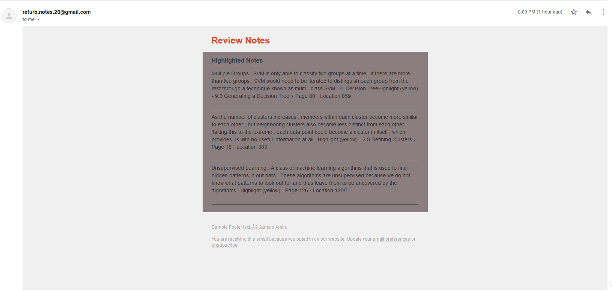
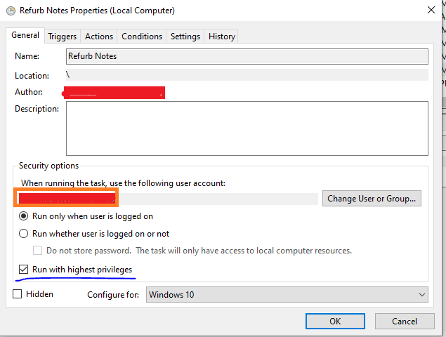

# Refurb Notes

Refurb Notes periodically sends you an email with randomly picked notes/highlights that you have taken while reading, so that you can review them. This enforces [spaced-repetition](https://en.wikipedia.org/wiki/Spaced_repetition) and helps you retain information better. 

Currently, Refurb Notes only supports highlights from Kindle. 

## How it works
The `data/notes` directory contains all your notes. It first randomly picks a file and then chooses `n` number of random highlights from the note file. Then it sends an email to you, configured in the `.env` file, with the randomly chosen highlights

## How to run
### Requirements
- Python 3+
- A new Gmail account (for safety)

### Setup Instructions

#### Initial setup
- Clone the project to your workspace/disk.

- Add your Kindle notes in the `data/notes` directory (there is a note html file from the book `Numsense! Data Science for the Layman No Math Added-Notebook` for reference). You should get the HTML version of the notes. Instructions on how to send yourself an email directly from Kindle can be found [here](https://the-digital-reader.com/2020/06/28/how-to-download-your-kindle-notes-and-highlights-and-export-them/).

#### Setting up .env file
- Create a `.env` file in `src` dir. Paste the following with the appropriate values:  
FROM=YOUR_NEWLY_CREATED_GMAIL  
PW=PASSWORD_FOR_THE_NEWLY_CREATED_GMAIL  
TO=EMAIL_YOU_WANT_SEND_TO  

NOTE: If you are using a Gmail account to send emails, you will need to turn ON [Allow Less Secure Apps](https://www.google.com/settings/security/lesssecureapps). This is why creating a dummy Gmail account is recommended.
#### Setting up automated job
#### Windows
- Open `scheduler_action.bat` file. Make sure all the paths are according to your system i.e. where python is installed etc. Also make sure the 
path to the virtual env (project/env) is set up correctly. The file paths currently is for reference only.  
- Open Windows Task Scheduler and Create a New Task.
- Make sure to give highest privilege to run the task.  

- Set up the trigger to choose how frequently you want the emails.
- Go to Actions tab, and under Programs/Script, browse to `scheduler_action.bat` file. 
- Click Ok and exit the modal. Your task should be created! To test, you can find the task in Task Scheduler and right click to choose Run. You should be getting an email. 

#### Non-Windows OS
You can use CRON jobs instead of Task Scheduler to schedule automated run.